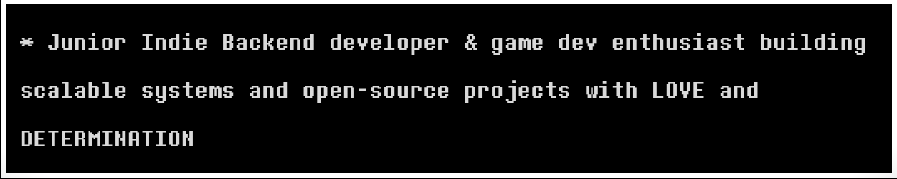

  <picture>
    <source media="(prefers-color-scheme: dark)" srcset="images/fonts/BannerDark.png" width="40%">
    <source media="(prefers-color-scheme: light)" srcset="images/fonts/BannerLight.png" width="40%">
    
  </picture>

  

<picture>
    <source media="(prefers-color-scheme: dark)" srcset="images/fonts/AboutLight.png" width="77%">
    <source media="(prefers-color-scheme: light)" srcset="images/fonts/AboutDark.png" width="77%">
    
</picture>

## About Me

<h3>My Streaks</h3>

<h3> My Stats </h3>

 
